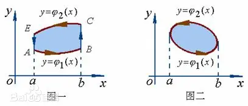

## [格林公式](https://baike.baidu.com/item/%E6%A0%BC%E6%9E%97%E5%85%AC%E5%BC%8F/4542338)

- 设 $D$ 为平面区域，如果 $D$ 内任一闭曲线所围的部分区域都属于 $D$，则 $D$ 称为平面[单连通区域](https://baike.baidu.com/item/%E5%8D%95%E8%BF%9E%E9%80%9A%E5%8C%BA%E5%9F%9F/8117100?fromModule=lemma_inlink)。直观地说，单连通区域是没有空间的区域，否则称为复连通区域。
- 当 $xOy$ 平面上的曲线起点与终点重合时，则称曲线为闭曲线。设平面的闭曲线L围成平面区域 $D$，并规定当一个人沿闭曲线 $L$ 环行时，区域 $D$ 总是位于此人的左侧，称此人行走方向为曲线 $L$ 关于区域 $D$ 的[正方向](https://baike.baidu.com/item/%E6%AD%A3%E6%96%B9%E5%90%91/7477159?fromModule=lemma_inlink)，反之为负方向。(*即逆时针为正方向*)

>[! 格林公式 Green Formula]
>设闭区域 $D$ 由分段光滑的曲线 $L$ 围成，函数 $P(x, y)$ 及 $Q(x, y)$ 在 $D$ 上具有一阶连续[偏导数](https://baike.baidu.com/item/%E5%81%8F%E5%AF%BC%E6%95%B0/5536984?fromModule=lemma_inlink)，则有
>  $$ \iint_{D} \left(  \frac{\partial Q}{\partial x} - \frac{\partial P}{\partial y} \right) dxdy = \oint_{L} Pdx + Qdy   $$
>  其中 $L$ 是 $D$ 取正向的边界曲线。

### 证明

先证明
$$ - \iint_{D} \frac{\partial P}{\partial y} dxdy = \oint_{L} Pdx   $$
假定区域 $D$ 的形状如下（用平行于 $y$ 轴的直线穿过区域，与区域边界曲线的交点至多两点）

易见，图1(二)所表示的区域是图1(一)所表示的区域的一种特殊情况，我们仅对图1(一)所表示的区域 $D$ 给予证明即可.
$$ D: a \leq x \leq b, \ \varphi_{1} (x) \leq y \leq \varphi_{2} (x) $$
$$ - \iint_{D} \frac{\partial P}{\partial y} dxdy = - \int_{a}^{b} dx \int_{\varphi_{1}(x)}^{\varphi_{2}(x)} \frac{\partial P}{\partial y} dy $$
$$ = - \int_{a}^{b} \left[ P (x, y) \right]_{y=\varphi_{1}(x)}^{y=\varphi_{2}(x)}  dx  = -\int_{a}^{b} \left[ P(x,\varphi_{2} (x) ) - P(x,\varphi_{1} (x) )  \right]  dx  $$
另一方面，据对坐标的曲线积分性质与计算法有

$$ \oint_{L} Pdx  = \left( \int_{\widehat{AB}} + \int_{\overline{BC}} + \int_{\widehat{CE}} + \int_{\overline{EA}} \right) Pdx     $$
$$ = \int_{a}^{b} P(x, \varphi_{1} (x)) dx + 0 + \int_{b}^{a} P(x, \varphi_{2}(x)) dx  + 0 $$
因此
$$ - \iint_{D} \frac{\partial P}{\partial y} dxdy = \oint_{L} Pdx   $$

假设将 $\widehat{AB}$ 曲线上移，或 $\widehat{CE}$ 曲线下移，使 $A,E$ 重合或者 $B, C$ 重合，便可以认为是一条常规的曲线。也可以认为某条常规曲线是将 $\overline{AE}$ 或 $\overline{BC}$ 长度设为零形成的。再假定穿过区域 $D$ 内部且平行于 $x$ 轴的直线与 $D$ 的边界曲线的交点至多是两点，用类似的方法可证

$$  \iint_{D} \frac{\partial Q}{\partial x} dxdy = \oint_{L} Qdy     $$
将两式合并之后即得格林公式。

### 例题1

> [! 例题1]
> 已知 $f(x, y)$ 在 $xOy$ 平面上有二阶连续偏导数，且
> $$ f(0, 0) = 0, \quad \frac{\partial^{2} f}{\partial x^{2}} + \frac{\partial^{2} f}{\partial y^{2}} = x^{2} + y^{2}  $$
> $L: x^{2} + y^{2} = a^{2} \ (a>0)$ , 逆时针方向，求
> $$ \oint_{L} f(x, y) ds  $$

 记 $g(t) \equiv f(tx, ty)$，则有 $g(1) - g(0) = f(x, y) - f(0, 0) = f(x, y)$，且根据牛顿-莱布尼茨公式，
 $$ g(1) - g(0) =  \int_{0}^{1} g'(t) dt = \int_{0}^{1} xf_{1}(tx, ty) + yf_{2} (tx, ty)\  dt $$
 因此，
 $$ \oint_{L} f(x,y) ds = \oint_{L} \int_{0}^{1} xf_{1}(tx, ty) + yf_{2} (tx, ty)\  dt ds  $$
 由于 $f(x,y)$ 有二阶连续偏导数，可知一阶偏导 $f_{1}, f_{2}$ 是有连续偏导数，积分次序可交换 , 且由于 $\left( -\frac{y}{a}, \frac{x}{a} \right)$ 为曲线 $L$ 的正向单位法向量，
 $$ \oint_{L} xf_{1}(tx, ty) + yf_{2} (tx, ty)\  ds = \oint_{L} \left( -\frac{y}{a}, \frac{x}{a} \right) \cdot \left( - af_{2} (tx, ty), af_{1} (tx, ty) \right)  \  ds $$
 $$ = \oint_{L} \left( - af_{2} (tx, ty), af_{1} (tx, ty) \right)  \cdot \  d\mathbf{s} = \oint_{L} - af_{2} (tx, ty)\ dx + af_{1} (tx, ty)\ dy  $$
根据格林公式，记闭区域 $D: x^{2} + y^{2} \leq a^{2}$, $P(x,y) \equiv - f_{2}(tx, ty)$, $Q(x,y) \equiv f_{1}(tx, ty)$
$$ \oint_{L} - af_{2} (tx, ty)\ dx + af_{1} (tx, ty)\ dy = a\iint_{D} \left( \frac{\partial Q}{\partial x} - \frac{\partial P}{\partial y} \right) dxdy $$
$$ = a \iint_{D} t\left( f_{11}(tx,ty) + f_{22} (tx, ty) \right) dxdy  = at^3 \iint_{D} (x^{2} + y^{2}) dxdy  $$
$$ = at^3 \int_{0}^{2\pi} d\theta \int_{0}^{a} r^2 \cdot r dr = at^3 \cdot 2\pi \cdot \frac{a^4}{4}= \frac{\pi}{2}a^5t^3 $$
 最后的区域积分用极坐标计算。因此，
 $$  \oint_{L} f(x,y) ds = \int_{0}^{1} \frac{\pi}{2} a^5 t^3 dt = \frac{\pi}{2} a^5 \left[ \frac{t^4}{4} \right]_{0}^{1} = \frac{\pi}{8} a^5  $$

